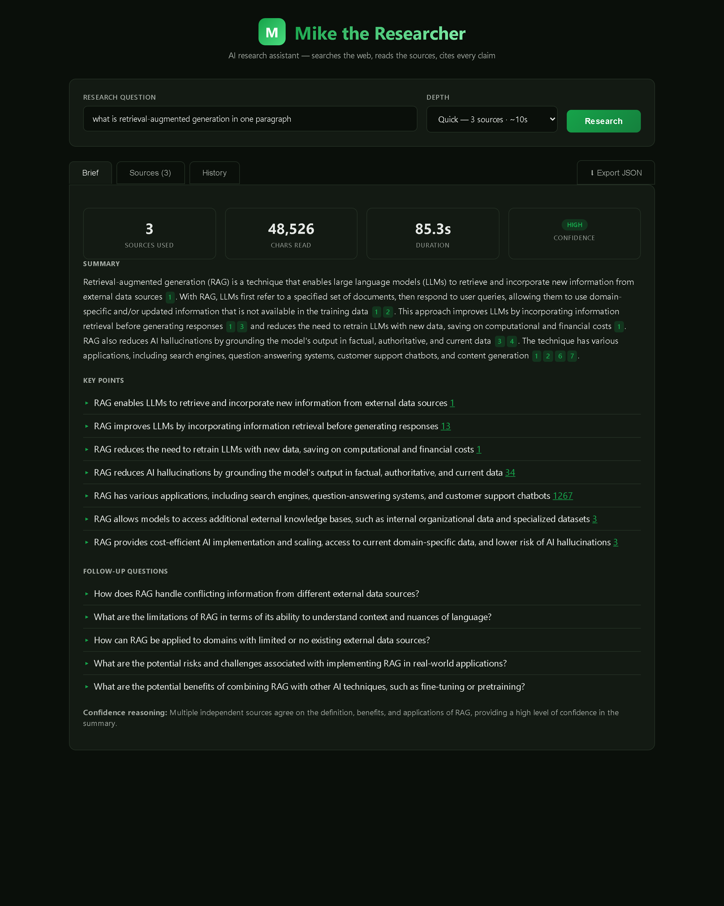

<div align="center">

# Mike the Researcher

### AI Research Assistant

**Ask a question. Mike searches the web, reads the sources, and writes a brief — with every claim cited.**

[](LICENSE)
[](https://github.com/Jinish2170/mike-the-researcher/releases)
[](https://www.typescriptlang.org/)
[](https://nodejs.org)
[](https://react.dev)
[](https://build.nvidia.com)
[](#contributing)

[**Quick Start**](#-quick-start) · [**Features**](#-features) · [**API**](#-api) · [**Architecture**](#-architecture) · [**Roadmap**](#-roadmap)

</div>

---

## Overview

**Mike the Researcher** is a self-hosted AI research assistant. Hand it a question — Mike searches the web, fetches the top sources, extracts the readable content with Mozilla Readability, and uses an LLM to synthesize a faithful brief with **inline numbered citations**.

No hallucinated facts: every claim must trace back to a source Mike actually fetched. If the sources don't answer the question, Mike says so plainly.

```
ChatGPT   → confident answer, hidden sources, sometimes hallucinated
Perplexity→ great UX, opinionated stack, your data sits on their servers
Mike      → your machine, your LLM, your sources, your data
```

---

## 📸 Dashboard

<div align="center">

<!-- Drop a real screenshot at docs/dashboard.png and this will render. -->


```
┌─────────────────────────────────────────────────────────────────────┐
│  [M]  Mike the Researcher                                           │
│       AI research assistant — searches the web, cites every claim   │
├─────────────────────────────────────────────────────────────────────┤
│  RESEARCH QUESTION                              DEPTH               │
│  ┌──────────────────────────────────────────┐  ┌──────────────┐    │
│  │ what is retrieval-augmented generation?  │  │ Standard ▾   │    │
│  └──────────────────────────────────────────┘  └──────────────┘    │
│                                                       [ Research ] │
├─────────────────────────────────────────────────────────────────────┤
│  [search]    Searching the web for: what is RAG...                  │
│  [fetch]     Reading https://en.wikipedia.org/wiki/RAG              │
│  [extract]   Extracted 14,820 chars from ibm.com                    │
│  [synthesize] Synthesizing brief with meta/llama-3.3-70b-instruct   │
│  [done]      Research complete in 24,102ms                          │
├─────────────────────────────────────────────────────────────────────┤
│  [ Brief ] [ Sources (6) ] [ History ]               ⬇ Export JSON  │
├─────────────────────────────────────────────────────────────────────┤
│   6 sources    48,526 chars    24.1s    [ medium ] confidence       │
│                                                                     │
│   SUMMARY                                                           │
│   Retrieval-augmented generation (RAG) is a technique that          │
│   enables LLMs to retrieve and incorporate new information from     │
│   external data sources [1]. ...                                    │
│                                                                     │
│   KEY POINTS                                                        │
│   ▸ RAG enables LLMs to retrieve external information [1]           │
│   ▸ RAG reduces retraining costs and computational expense [1]      │
│   ▸ Used in search, Q&A, customer-support chatbots [2]              │
│                                                                     │
│   FOLLOW-UPS  (click to set as next query)                          │
│   ▸ What are the limitations and potential drawbacks of RAG?        │
│   ▸ How does RAG handle conflicting information across sources?     │
└─────────────────────────────────────────────────────────────────────┘
```

</div>

---

## 🎬 Example output

Query: `what is retrieval-augmented generation in one paragraph` · depth `quick`
Backed by 3 sources · 18.0s · `meta/llama-3.3-70b-instruct` · confidence **medium**

> Retrieval-augmented generation (RAG) is a technique that enables large language models (LLMs) to retrieve and incorporate new information from external data sources **[1]**. With RAG, LLMs first refer to a specified set of documents, then respond to user queries **[1]**. This allows LLMs to use domain-specific and/or updated information that is not available in the training data **[2]**. RAG improves LLMs by incorporating information retrieval before generating responses **[3]**, and reduces the need to retrain LLMs with new data, saving on computational and financial costs **[1]**. According to IBM, RAG empowers organizations to avoid high retraining costs when adapting generative AI models to domain-specific use cases **[3]**.

**Key points** Mike pulled out:
- RAG enables LLMs to retrieve and incorporate new information from external data sources **[1]**
- RAG improves LLMs by incorporating information retrieval before generating responses **[3]**
- RAG reduces the need to retrain LLMs with new data, saving on computational and financial costs **[1]**
- RAG can be used in search engines, question-answering systems, and customer-support chatbots **[2]**
- RAG allows LLMs to include sources in their responses, providing greater transparency and verifiability **[1]**

**Follow-ups** Mike suggested:
- What are the limitations and potential drawbacks of using RAG?
- How does RAG handle conflicting or inconsistent information in external sources?
- What are the potential applications of RAG in healthcare and finance?

**Sources** Mike actually read end-to-end:
1. [Retrieval-augmented generation — Wikipedia](https://en.wikipedia.org/wiki/Retrieval-augmented_generation)
2. [What is Retrieval Augmented Generation (RAG)? — Databricks](https://www.databricks.com/blog/what-is-retrieval-augmented-generation)
3. [What is RAG (Retrieval Augmented Generation)? — IBM](https://www.ibm.com/think/topics/retrieval-augmented-generation)

Every `[n]` in the summary maps to a real source Mike fetched and read — no orphaned claims.

---

## ✨ Features

| | |
|---|---|
| 🔎 **Web search** | DuckDuckGo HTML (no key, free) by default; optional Tavily API for higher quality |
| 📄 **Real content extraction** | Mozilla Readability + JSDOM — pulls the article body, not the chrome |
| 🧠 **Cited synthesis** | NVIDIA NIM (default: Llama 3.3 70B) — every claim tagged with `[n]` citation |
| 🎯 **Three research depths** | `quick` (3 sources, ~10s), `standard` (6 sources, ~25s), `deep` (10 sources, ~60s) |
| 📡 **Streaming progress** | SSE endpoint streams each phase (search → fetch → extract → synthesize) live to the UI |
| 💾 **History & persistence** | Every research auto-saves to `research/YYYY-MM-DD/` — resume, compare, export JSON |
| 🖥 **Web dashboard** | React + Vite UI with Brief / Sources / History tabs, clickable citations, follow-up questions |
| 🔌 **REST API** | Drop-in for automation; OpenAI-compatible LLM client (NVIDIA NIM, OpenRouter, Groq, OpenAI, local Ollama) |
| 🆓 **Free defaults** | Free NVIDIA NIM tier + free DuckDuckGo search = $0/research |

---

## 🚀 Quick Start

### Prerequisites

- **Node.js 20+**
- **NVIDIA NIM API key** — free at [build.nvidia.com](https://build.nvidia.com/) (or any OpenAI-compatible provider: OpenRouter, OpenAI, Groq, Together, local Ollama)

### Install & run

```bash
git clone https://github.com/Jinish2170/mike-the-researcher.git
cd mike-the-researcher

# Backend + frontend deps
npm install
cd frontend && npm install && cd ..

# Configure your LLM key
cp .env.example .env
#  → edit .env, paste your NVIDIA NIM key into LLM_API_KEY

# Start API (:3002) + dashboard (:3000)
npm run start:all
```

Open **http://localhost:3000** and ask Mike a question.

### CLI

```bash
npm run dev -- "what is retrieval-augmented generation?"
npm run dev -- "latest progress on fusion energy" deep
```

### REST

```bash
npm run api    # backend only on :3002

curl -X POST http://localhost:3002/research \
  -H "Content-Type: application/json" \
  -d '{"query":"what is RAG?", "depth":"standard"}'
```

---

## ⚙ Configuration

`.env` settings (see `.env.example`):

| Variable | Default | Purpose |
|----------|---------|---------|
| `LLM_API_KEY` | *(required)* | API key for your LLM provider |
| `LLM_BASE_URL` | `https://integrate.api.nvidia.com/v1` | OpenAI-compatible endpoint |
| `LLM_MODEL` | `meta/llama-3.3-70b-instruct` | Model id at that endpoint |
| `TAVILY_API_KEY` | *(optional)* | If set, Tavily is used instead of DuckDuckGo |
| `PORT` | `3002` | Backend port |
| `REQUEST_TIMEOUT_MS` | `15000` | Per-request HTTP timeout |
| `FETCH_CONCURRENCY` | `4` | Parallel source fetches |
| `MAX_CONTENT_CHARS` | `8000` | Per-source character cap fed to the LLM |

### Other providers

Set `LLM_BASE_URL` / `LLM_MODEL` to point anywhere OpenAI-compatible:

```env
# OpenRouter
LLM_BASE_URL=https://openrouter.ai/api/v1
LLM_MODEL=qwen/qwen-2.5-72b-instruct:free

# Groq
LLM_BASE_URL=https://api.groq.com/openai/v1
LLM_MODEL=llama-3.3-70b-versatile

# Local Ollama
LLM_BASE_URL=http://localhost:11434/v1
LLM_MODEL=llama3.3
LLM_API_KEY=ollama
```

---

## 📡 API

| Method | Path | Purpose |
|--------|------|---------|
| `GET`  | `/health` | Liveness check |
| `POST` | `/research` | Run research. Body: `{ query, depth? }`. Auto-persists. |
| `POST` | `/research/stream` | Same, streams progress via Server-Sent Events |
| `GET`  | `/researches?limit=50` | List past research (newest first) |
| `GET`  | `/research/:id` | Load a full past record |

### Request / response

```jsonc
POST /research
{
  "query": "what is retrieval-augmented generation?",
  "depth": "standard"          // quick | standard | deep
}
```

```jsonc
{
  "success": true,
  "id": "res-1778993560091-a4a59m",
  "query": "what is retrieval-augmented generation?",
  "depth": "standard",
  "brief": {
    "summary": "RAG is a technique that... [1] ... [2,3].",
    "keyPoints": ["RAG retrieves... [1]", "..."],
    "followUpQuestions": ["When does RAG beat fine-tuning?", "..."],
    "confidence": "medium",
    "reasoning": "Multiple independent sources agree on the definition."
  },
  "sources": [
    { "id": 1, "url": "...", "title": "...", "domain": "ibm.com",
      "snippet": "...", "charCount": 14820, "fetchedAt": "...", "status": "ok" }
  ],
  "stats": {
    "searchResults": 10, "sourcesFetched": 6, "sourcesFailed": 0,
    "totalCharsRead": 48526, "durationMs": 24102,
    "model": "meta/llama-3.3-70b-instruct"
  },
  "createdAt": "2026-05-17T..."
}
```

### Streaming progress

```bash
curl -N -X POST http://localhost:3002/research/stream \
  -H "Content-Type: application/json" \
  -d '{"query":"...","depth":"standard"}'

# event: progress
# data: {"phase":"search","message":"Searching the web..."}
# event: progress
# data: {"phase":"fetch","message":"Reading https://..."}
# event: result
# data: { ...full ResearchRecord... }
```

---

## 🏗 Architecture

```
mike-the-researcher/
├── src/
│   ├── api/server.ts              Express API (REST + SSE)
│   ├── research/
│   │   ├── engine.ts              Orchestrator: search → fetch → extract → synthesize
│   │   ├── prompts.ts             System prompt + JSON-schema user prompt
│   │   └── store.ts               File-based research persistence
│   ├── search/
│   │   ├── duckduckgo.ts          Keyless HTML search
│   │   ├── tavily.ts              Optional API search
│   │   └── index.ts               Backend selector
│   ├── extract/readability.ts     Mozilla Readability + JSDOM
│   ├── llm/client.ts              OpenAI-compatible chat client
│   ├── config.ts                  Env-driven config
│   ├── types/                     Shared TypeScript types
│   └── index.ts                   CLI entry + library exports
│
├── frontend/                      React + Vite dashboard
│   ├── src/App.tsx                Brief / Sources / History tabs, SSE consumer
│   └── src/App.css                Dark green theme
│
└── research/                      Auto-saved results (gitignored)
    └── YYYY-MM-DD/
        └── <query>__<id>.json
```

### Pipeline

```
       ┌───────────┐    ┌──────────┐    ┌─────────┐    ┌─────────────┐
query →│  Search   │──→ │ Fetch +  │──→ │ Build   │──→ │ LLM         │ → cited brief
       │ DDG/Tavily│    │ extract  │    │ context │    │ (NVIDIA NIM)│
       └───────────┘    │ (Readab.)│    │ + cites │    └─────────────┘
                        └──────────┘    └─────────┘
```

### Design principles

| Principle | Practice |
|-----------|----------|
| **Citations are mandatory** | The system prompt requires `[n]` after every non-trivial claim — no orphan facts |
| **Faithful, not flashy** | If sources disagree, surface the disagreement. If they don't answer, say so. |
| **Deterministic plumbing** | Search → fetch → extract is fully deterministic. Only the synthesis step is LLM. |
| **Provider-agnostic** | Any OpenAI-compatible endpoint works. Default to free NVIDIA NIM tier. |
| **Audit trail** | Every research persists full sources + extracted text. You can re-read what Mike read. |

---

## 🛠 Commands

| Command | Description |
|---------|-------------|
| `npm run start:all` | API on `:3002` **and** dashboard on `:3000` (recommended) |
| `npm run api` | Backend API only |
| `npm run frontend:dev` | Dashboard dev server only |
| `npm run dev -- "<question>" [depth]` | Headless CLI research |
| `npm run build` | Compile backend |
| `npm run frontend` | Build production dashboard |
| `npm run typecheck` | TypeScript check, no emit |

---

## 🗺 Roadmap

- [x] **v0.1** — Web search + Readability extraction + cited synthesis + dashboard + SSE
- [ ] **v0.2** — PDF/arXiv source support, follow-up auto-research (one-click on follow-ups)
- [ ] **v0.3** — Multi-step planning (decompose hard questions into sub-questions)
- [ ] **v0.4** — Vector store for cross-research recall ("what did I learn about X last week?")
- [ ] **v0.5** — Scheduled re-research / watch mode for evolving topics
- [ ] **v1.0** — Production-ready research workstation

---

## 🆚 How it compares

| | Mike | ChatGPT | Perplexity | Manual |
|---|:---:|:---:|:---:|:---:|
| Every claim cited inline | ✅ | ⚠️ | ✅ | — |
| Reads full sources (not just snippets) | ✅ | ❌ | ✅ | ✅ |
| Your LLM key, your data | ✅ | ❌ | ❌ | ✅ |
| Open source | ✅ | ❌ | ❌ | — |
| Free out of the box | ✅ | ⚠️ | ⚠️ | ✅ |
| Programmable REST API | ✅ | ⚠️ | ❌ | ❌ |
| Local persistence + history | ✅ | ⚠️ | ⚠️ | ❌ |

---

## 🤝 Contributing

PRs and issues welcome.

1. Fork, branch, commit
2. `npm run typecheck && npm run build`
3. Open a PR against `master`

Good first issues:
- Add PDF support to the extractor
- Add arXiv as a dedicated source backend
- Add a "compare" mode (run the same query twice on different dates, diff the briefs)
- Add unit tests for `research/engine.ts` (mock search + LLM)

---

## ⚠ Legal & Ethics

Built for research, journalism, education, and personal knowledge work.

- Respect `robots.txt` and platform Terms of Service
- Honor published rate limits
- Mike summarizes publicly-accessible pages; verify critical findings via primary sources
- You are responsible for how you use the synthesized output

---

## 📄 License

MIT © [Jinish Dhola](https://github.com/Jinish2170)

---

<div align="center">

**Built with TypeScript, Express, React, and NVIDIA NIM.**

[⭐ Star on GitHub](https://github.com/Jinish2170/mike-the-researcher) · [🐛 Report an issue](https://github.com/Jinish2170/mike-the-researcher/issues)

</div>
